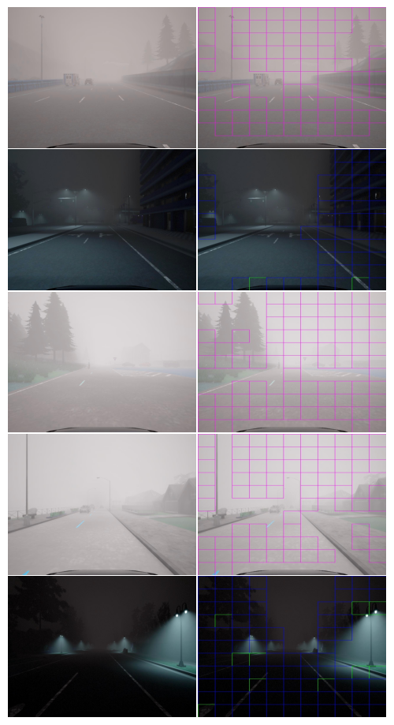

# Foggy Image Evaluator: AuthESI

Inspired by the paper titled "Towards Simulating Foggy and Hazy Images and Assessing Their Authenticity," this code aims to implement an innovative approach.

Referenced GitHub repository: [FoHIS](https://github.com/noahzn/FoHIS).

The core concept involves identifying foggy regions within images and subsequently extracting pertinent features during the training phase. During evaluation, these features' spatial distribution is measured to derive the Fog-Score.

This Fog-Score serves as a quantitative indicator, revealing the fidelity of fog particle distribution in comparison to the authentic dataset used for training.